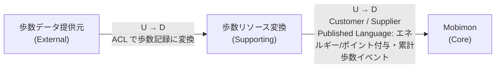
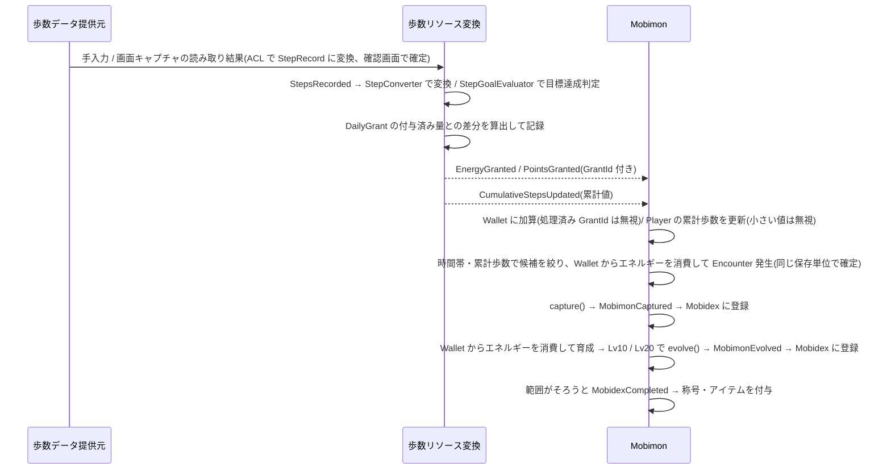

# ドメイン設計

MobimonGO のドメイン設計を、以下の3点で整理する。

1. [ユビキタス言語(用語集)](#1-ユビキタス言語用語集)
2. [境界づけられたコンテキスト(コンテキストマップ)](#2-境界づけられたコンテキストコンテキストマップ)
3. [ドメインモデルの定義](#3-ドメインモデルの定義)

> 注: README のドメイン分解(Mobimon = Core / 歩数リソース変換 = Supporting)を出発点としている。
> README に記載のない項目は、議論で決定した内容を反映している。まだ決まっていないものは末尾の「未決事項」にまとめる。

---

## 1. ユビキタス言語(用語集)

コード上のクラス名・メソッド名・イベント名はこの表の英語表記に揃える。

### Mobimon コンテキスト

| 用語 | 英語表記 | 定義 |
|---|---|---|
| モビモン | Mobimon | ゲーム内で収集対象となるキャラクター。個体を指す。 |
| モビモン種 | MobimonSpecies | モビモンの種類(マスターデータ)。図鑑の1エントリに対応する。 |
| プレイヤー | Player | モビモンを収集するアプリ利用者のゲーム内での表現。 |
| 出現 | Encounter | プレイヤーの前にモビモンが現れること。エネルギーを消費すると必ず1体出現し、どの種が出るかは、出現条件を満たす種の中から、種ごとの重み(レア度で決まる)に比例した抽選で決まる。 |
| 出現条件 | EncounterCondition | モビモン種ごとに定める、出現候補になるための条件。「出現する時間帯」と「解放に必要な累計歩数」の2要素で決める。 |
| 時間帯 | TimeOfDay | 出現時刻(端末のローカル時刻)の区分。朝(5〜10時)/ 昼(10〜16時)/ 夕(16〜19時)/ 夜(19〜翌5時)の4区分。 |
| 累計歩数 | CumulativeSteps | 歩数リソース変換から受け取る、プレイヤーのアプリ利用開始以降の歩数の合計。種の解放判定にだけ使う。 |
| 解放 | Unlock | 累計歩数が種ごとの閾値に達し、その種が出現候補に加わること。一度解放された種は候補から外れない。 |
| 捕獲 | Capture | 出現したモビモンをプレイヤーの所持モビモンにすること。 |
| 所持モビモン | OwnedMobimon | プレイヤーが捕獲して所有しているモビモン個体。 |
| 育成 | Training | エネルギーを 10 消費して、所持モビモンに経験値 100 を与えること。 |
| 経験値 | Experience | 育成で得られ、一定量たまるとレベルが上がる値。次のレベルに必要な量は `50 × 現在のレベル`。 |
| 進化 | Evolution | 所持モビモンが条件レベルに達したとき、プレイヤーの操作で系統の次の種に変わること。レベル・経験値は引き継ぐ。 |
| 図鑑 | Mobidex | プレイヤーが捕獲または進化で手に入れたことのあるモビモン種の記録。 |
| 事業分野 | BusinessField | モビモン種のモチーフとなる事業分野(8分野)。事業分野コンプリートの範囲に使う。どの事業分野にも属さない種もある(伝説のデンまる)。 |
| 図鑑コンプリート | MobidexCompletion | 定めた範囲の種をすべて図鑑に登録し終えた状態。事業分野コンプリート(その分野の超レアを除く全種)と全体コンプリート(151種すべて)の2種類。 |
| 登録数の節目 | Milestone | 図鑑の登録数が 10 / 30 / 50 / 100種に達したこと。デンまるの初登録も特別な節目として扱う。 |
| 称号 | Title | 図鑑コンプリートの報酬としてプレイヤーに与えられる呼び名。 |
| アイテム | Item | ポイントで購入し、使用するとゲーム内の効果を得られる道具。種類・価格・効果はマスターデータで定義する。エネルギーを使ったときの成果を増幅するだけで、エネルギーの代わりにはならない。 |
| 出現率アップアイテム | EncounterBoostItem | 使用するとレア以上のモビモン種の出現重みに倍率が掛かり、レアなモビモンが出やすくなるアイテム。 |
| 育成アイテム | TrainingItem | 使用すると育成で得られる経験値に倍率が掛かるアイテム。 |
| アイテム効果 | ItemEffect | アイテムを使用して得られる効果。種別・倍率・持続回数で表す。 |
| 残り回数 | RemainingUses | 使用中の効果が、あと何回の出現/育成に適用されるか。 |
| 購入 | Purchase | ポイントを支払ってアイテムを入手すること。 |
| 所持アイテム | Inventory | プレイヤーが所有するアイテムとその個数。 |
| ウォレット | Wallet | プレイヤーが保有するエネルギーとポイントの残高。Mobimon コンテキストが管理する。 |

### 歩数リソース変換コンテキスト

| 用語 | 英語表記 | 定義 |
|---|---|---|
| ウォーカー | Walker | 歩数の持ち主としてのユーザー。利用開始日を持つ。Mobimon の `Player` と同じ人を指し、IDも同じ値を使う。 |
| 歩数 | StepCount | スマホ等から取得した、ある期間の歩いた数。 |
| 歩数記録 | StepRecord | 特定ユーザー・特定日の歩数の取り込み結果。 |
| 取り込み元 | StepSource | 歩数をどこから取り込んだか。「手入力」と「画面キャプチャ」の2種類。 |
| 手入力 | ManualEntry | ユーザーが日付と歩数を画面に直接入力して取り込むこと。 |
| 画面キャプチャ取り込み | ScreenCaptureImport | 他のヘルスケアアプリの歩数画面のキャプチャ画像から、カレンダーに表示された日々の歩数を読み取って取り込むこと。 |
| 利用開始日 | StartDate | ユーザーがアプリの利用を始めた日。これより前の歩数は取り込まない。利用開始日の歩数は、その日の0時からすべて数える。 |
| 累計歩数 | CumulativeSteps | 特定ユーザーの `StepRecord`(利用開始日以降)の合計。Mobimon へ公開する。 |
| エネルギー | Energy | 歩くことで貯まる「1日の行動リソース」(＝歩く努力の結晶)。歩数から変換され、出現・育成などのゲーム内行動で消費する。使い切れなかった分は翌日以降に持ち越せる。 |
| 変換 | Conversion | 歩数をエネルギーへ換算する処理。 |
| 変換ルール | ConversionRule | 歩数→エネルギーの換算規則。100歩 = 1エネルギー(端数切り捨て)、1日の上限は 20,000歩分(200エネルギー)。 |
| 目標歩数 | StepGoal | ポイント獲得の基準となる1日の歩数。全ユーザー共通の固定値(8,000歩)。 |
| ポイント | Point | 目標歩数を達成したご褒美として獲得する「ゲーム内通貨」。出現率アップアイテム・育成アイテムの購入に使う。ポイントでエネルギーは買えない。 |
| ポイント付与ルール | PointAwardRule | 1日の歩数が目標歩数に達したら 10pt、目標歩数を 500歩超えるごとに +5pt を付与する規則。1日の上限はエネルギーと同じ 20,000歩で、それを超えた歩数は数えない(1日の最大 130pt)。 |
| 日次付与記録 | DailyGrant | 特定ユーザー・特定日に付与済みのエネルギー/ポイントの量。二重付与の防止に使う。 |
| 付与ID | GrantId | 付与イベント(`EnergyGranted` / `PointsGranted`)を一意に識別するID。 |

### 同じ言葉がコンテキストで意味を変えるもの

| 言葉 | Mobimon での意味 | 歩数リソース変換での意味 |
|---|---|---|
| ユーザー | `Player`(ゲームの主体) | `Walker`(歩数の持ち主) |
| エネルギー | 出現・育成で「消費するもの」 | 歩数から「生成するもの」 |
| ポイント | アイテム購入で「使うもの」 | 目標歩数の達成で「付与するもの」 |
| 歩数 | 累計値だけを受け取り、種の解放判定に使う | 日ごとに取り込み、エネルギー/ポイントへ変換する |

---

## 2. 境界づけられたコンテキスト(コンテキストマップ)

### コンテキスト一覧

| コンテキスト | 種別 | 責務 |
|---|---|---|
| Mobimon | Core | 出現ロジック、捕獲、育成・進化、図鑑管理・コンプリート報酬、アイテムの購入・使用、エネルギー/ポイント残高の管理。サービス独自の強みであり最も注力する。 |
| 歩数リソース変換 | Supporting | 歩数の取り込み、エネルギーへの変換、目標歩数達成によるポイント付与(付与量の算出と通知。残高は持たない)、累計歩数の公開。 |
| 歩数データ提供元 | External(Generic) | 当面は「ユーザーの手入力」と「他のヘルスケアアプリの歩数画面のキャプチャ画像」の2つ。端末の歩数API(HealthKit / Health Connect など)との連携は将来対応。 |

### コンテキストマップ

### 関係の説明

| 上流 (U) | 下流 (D) | 関係パターン | 内容 |
|---|---|---|---|
| 歩数データ提供元 | 歩数リソース変換 | Anticorruption Layer | 手入力の値や、キャプチャ画像のカレンダーから読み取った値を、腐敗防止層で `StepRecord` に変換してから取り込む。キャプチャ元アプリの画面の変更や、将来の端末の歩数APIの形式をコンテキスト内に波及させない。利用開始日より前の歩数は取り込まない。 |
| 歩数リソース変換 | Mobimon | Customer / Supplier + Published Language | Mobimon(顧客)が必要とするエネルギー/ポイントと累計歩数を、歩数リソース変換(供給者)がイベント/APIとして公開する。Mobimon は日々の歩数や変換ルールを知らず、エネルギー/ポイントと累計歩数だけを受け取る。付与イベントは `GrantId` を持ち、Mobimon は同じ `GrantId` を二度加算しない。イベントに載る `WalkerId` は、Mobimon でそのまま `PlayerId` として扱う(同じ値のため対応表は不要)。 |

### 境界の原則

- Mobimon コンテキストは日々の歩数・変換ルール・目標歩数に依存しない。依存するのは付与されたエネルギー/ポイントと、公開された累計歩数のみ。累計歩数は種の解放判定にだけ使う。
- 変換ルールの変更(レート調整など)は歩数リソース変換コンテキスト内で完結させる。
- 目標歩数やポイント付与ルールの判定は歩数リソース変換コンテキスト内で完結させる。Mobimon は付与されたポイントを受け取って保持・使用する。
- エネルギー/ポイントの残高は Mobimon コンテキストの `Wallet` が所有する。消費はすべて Mobimon の行動で起きるため、残高と行動を同じコンテキストに置き、Core が Supporting に同期依存しないようにする。歩数リソース変換は付与量を算出してイベントで通知するだけで、消費については知らない。
- 消費(出現・育成でのエネルギー、アイテム購入でのポイント)は、行動と同じ保存単位(DB 導入後は1トランザクション)で確定する。

---

## 3. ドメインモデルの定義

### 3.1 Mobimon コンテキスト(Core)

#### 集約

| 集約(ルート) | 含むもの | 主な振る舞い | 不変条件 |
|---|---|---|---|
| `Player` | `PlayerId`, `CumulativeSteps`, 獲得した称号の一覧 | `updateCumulativeSteps(steps)`, `grantTitle(title)` | 1人のユーザーにつき1つ(`PlayerId` は `WalkerId` と同じ値)。作成時に `Wallet`(残高 0)・`Inventory`(空)・`Mobidex`(空)を同じ保存単位で1つずつ作る。累計歩数は減らない(受け取った値が現在より小さければ無視する)。同じ称号は重複しない。所持モビモンの数に上限は設けない(DB 連携時に見直す)。 |
| `Wallet` | `PlayerId`, `Energy`, `Point`, 処理済み `GrantId` の集合 | `receiveEnergy(grantId, energy)`, `receivePoints(grantId, point)`, `spendEnergy(energy)`, `spendPoints(point)` | 残高は負にならない。同じ `GrantId` は二度加算しない。日付が変わっても残高はリセットしない(持ち越し)。 |
| `Encounter` | `EncounterId`, `PlayerId`, `MobimonSpeciesId`, 状態(出現中/捕獲済み/逃走) | `capture()`, `flee()` | 捕獲済み・逃走済みの出現は再度捕獲できない。 |
| `OwnedMobimon` | `OwnedMobimonId`, `PlayerId`, `MobimonSpeciesId`, `Experience`(累計)。`Level` は累計経験値から決まる | `train(expMultiplier)`(経験値 100 × 倍率を加え、必要量に達したらレベルを上げる), `evolve(toSpeciesId)` | レベルは 1〜30(捕獲時は 1、Lv30 では経験値が増えない)。進化は、条件レベルに達していて、進化先が `MobimonSpecies` の進化先に含まれるときだけできる。 |
| `Mobidex` | `PlayerId`, 登録済み `MobimonSpeciesId` の集合, 達成済みのコンプリート・節目 | `register(speciesId)`, `isCompleted(scope)`(scope: 事業分野 / 全体) | 同じ種は重複登録しない。同じコンプリート・節目は二度達成しない。 |
| `MobimonSpecies` | `MobimonSpeciesId`, 名前, レア度, `EncounterCondition`, `BusinessField`(なしも可), 進化先(`MobimonSpeciesId` の一覧), 進化に必要なレベル | `canAppear(timeOfDay, cumulativeSteps)` | マスターデータ(参照専用)。すべての時間帯に、累計 0歩で解放されるコモンの種が1種以上ある(出現候補が空にならない)。 |
| `Item` | `ItemId`, 名前, 価格(`Point`), `ItemEffect` | — | マスターデータ(参照専用)。 |
| `Inventory` | `PlayerId`, `ItemId` ごとの個数, 使用中の効果(種別, 倍率, 残り回数) | `add(itemId, quantity)`, `use(itemId)`, `consumeEffect(種別)` | 個数は負にならず、1種類 99個を超えない。持っていないアイテムは使えない。同じ種別の効果が残っている間は同じ種別のアイテムを使えない(出現率アップと育成は同時に使える)。 |

- 特別な節目(デンまるの初登録)は、どの事業分野にも属さない種の初登録として判定する。
- 所持モビモンの一覧は `Player` に持たせず、`OwnedMobimon` を `PlayerId` で検索して得る(集約どうしはIDで参照し、捕獲のたびに2つの集約を更新しないため)。

#### 値オブジェクト

- `PlayerId`, `MobimonSpeciesId`, `OwnedMobimonId`, `EncounterId`, `ItemId`
- `Level` — 1〜30
- `Experience` — 0 以上の整数
- `BusinessField` — 事業分野(8分野)。種によっては持たない
- `Title` — 称号
- `EncounterCost` / `TrainingCost` — 出現・育成1回のエネルギー消費量(どちらも 10)。ゲームの調整値なので Mobimon 側で持つ
- `Rarity` — レア度。コモン / アンコモン / レア / 超レア の4段階。1種あたりの重みは 10 / 5 / 2 / 1
- `ItemEffect` — 種別(出現率アップ/育成), 倍率, 持続回数
- `Energy`, `Point` — 0 以上の数量
- `GrantId` — 歩数リソース変換から受け取る付与イベントのID
- `TimeOfDay` — 朝(5:00〜9:59)/ 昼(10:00〜15:59)/ 夕(16:00〜18:59)/ 夜(19:00〜翌4:59)
- `CumulativeSteps` — 0 以上の整数
- `EncounterCondition` — 出現する時間帯の集合(1つ以上。全時間帯も可), 解放に必要な累計歩数(0 以上)

#### ドメインサービス

- `EncounterGenerator` — 出現条件・レア度・消費リソース・使用中の出現率アップ効果から、どのモビモン種を出現させるかを決める。**サービスの差別化の中心となるロジック。**
  1. 出現時刻の `TimeOfDay` と `Player` の `CumulativeSteps` で、出現条件を満たす種(候補)に絞る。
  2. 各候補に、レア度で決まる重み(コモン 10 / アンコモン 5 / レア 2 / 超レア 1)を付ける。出現率アップ効果が使用中なら、レア・超レアの重みに倍率(×2 / ×3)を掛ける。
  3. 重みに比例して1種を抽選する。
  - 1種ずつに重みを付けるのは、種数の多いレア度で1種あたりの確率が薄まり、レア度の順序(コモン > アンコモン > レア > 超レア)が逆転するのを防ぐため。
  - 目安(全種解放済み): レア以上の合計は時間帯により 5.4〜7.5%(アロマ使用時 10.3〜13.9%、アロマ+ 使用時 14.7〜19.5%)。特定の超レア1種に会うまで平均 約330〜440回の出現。
- `ItemPurchaseService` — `Wallet` からポイントを消費し、`Inventory` にアイテムを追加する。ポイント不足なら購入できない。

#### アイテム一覧(初期マスターデータ)

価格は「目標をちょうど達成する人(10pt/日)で2〜3日に1つ」を基準にしている。

| アイテム | 種別 | 効果量 | 持続 | 価格 |
|---|---|---|---|---|
| おさんぽアロマ | 出現率アップ | レア以上の重み ×2 | 次の3回の出現 | 30pt |
| おさんぽアロマ+ | 出現率アップ | レア以上の重み ×3 | 次の5回の出現 | 80pt |
| げんきフード | 育成 | 得られる経験値 ×1.5 | 次の1回の育成 | 20pt |
| げんきフード+ | 育成 | 得られる経験値 ×2 | 次の3回の育成 | 70pt |

- 持続は時間ではなく回数で数える。出現率アップは出現1回ごと(捕獲・逃走を問わない)、育成アイテムは育成1回ごとに残り回数が1減る。
- 購入回数の制限はない。
- 出現・育成では、`Wallet` からのエネルギー消費、行動、`Inventory` の効果の残り回数の減算を同じ保存単位で確定する。

#### 育成と進化

| 項目 | ルール |
|---|---|
| 育成1回 | エネルギー 10 を消費し、経験値 100 を得る(育成アイテム使用中は ×1.5 / ×2) |
| レベルアップ | 次のレベルに必要な経験値は `50 × 現在のレベル`。上限 Lv30 |
| 進化の条件 | 2段階目へは Lv10、3段階目へは Lv20。単独種は進化しない |
| 進化のタイミング | 条件を満たしたら、プレイヤーが好きなときに進化させる(自動では進化しない)。エネルギー・ポイントは使わない |
| 分岐 | ハイブリコは Lv10 で、プラグリン / バッテリオン / スイソリンからプレイヤーが1つを選ぶ |
| 図鑑 | 進化で得た種も図鑑に登録する |
| レベルの意味 | 現時点では進化の条件としてだけ使う |

目安(全エネルギーを1体の育成に使った場合): Lv10 は育成 23回・約3日、Lv20 は 95回・約12日、Lv30 は 218回・約27日。

#### 図鑑コンプリートと報酬

| 達成 | 範囲 | 報酬 |
|---|---|---|
| 登録数の節目 | 10 / 30 / 50種 | おさんぽアロマ ×1 |
| 登録数の節目 | 100種 | おさんぽアロマ+ ×1 |
| 特別な節目 | デンまるを捕まえて図鑑に初めて登録したとき | 称号「Dワールドの覇者」 |
| 事業分野コンプリート(8つ) | その事業分野の種のうち、超レアを除いたすべて | その事業分野の称号(下表)+ おさんぽアロマ+ ×1 + げんきフード+ ×1 |
| 全体コンプリート | 151種すべて(超レアを含む) | 称号「モビモンマスター」+ おさんぽアロマ+ ×3 + げんきフード+ ×3 |

称号(マスターデータ: 称号ID, 名前, 対応するコンプリートの範囲):

| コンプリート | 称号 |
|---|---|
| サーマルマネジメント&エアコンシステム | 熱と風の達人 |
| パワートレインシステム | 動力の達人 |
| セーフティ&コックピットシステム | 安全と快適の達人 |
| 半導体・先進デバイス | 半導体の達人 |
| 自動車補修用部品・アクセサリー/修理サービス | 整備の達人 |
| インダストリー | ものづくりの達人 |
| フードバリューチェーン | 食と農の達人 |
| ホーム | 暮らしの達人 |
| 全体コンプリート(151種) | モビモンマスター |
| デンまるの捕獲(特別な節目) | Dワールドの覇者 |

- 報酬はアイテムと称号だけにする。エネルギーは歩数からのみ、ポイントは目標歩数の達成でのみ得る方針を守るため、エネルギー・ポイントは報酬にしない。
- 同じ報酬は二度渡さない。アイテムの所持上限(99個)を超える分は、空きができるまで受け取りを保留する。

#### ドメインイベント

| イベント | 発生タイミング | 主な購読者 |
|---|---|---|
| `MobimonEncountered` | モビモンが出現した | — |
| `MobimonCaptured` | 捕獲に成功した | `Mobidex`(図鑑登録) |
| `MobimonTrained` | 育成で経験値・レベルが上がった | — |
| `MobimonEvolved` | 進化した | `Mobidex`(進化先の種を図鑑登録) |
| `MobidexCompleted` | 図鑑がコンプリートされた(範囲: 事業分野 / 全体) | 報酬付与(`Inventory.add()`・`Player.grantTitle()`) |
| `MobidexMilestoneReached` | 登録数の節目、またはデンまるの初登録に達した | 報酬付与(`Inventory.add()`・`Player.grantTitle()`) |
| `ItemPurchased` | ポイントでアイテムを購入した | — |
| `ItemUsed` | アイテムを使用した | — |

### 3.2 歩数リソース変換コンテキスト(Supporting)

#### 集約

| 集約(ルート) | 含むもの | 主な振る舞い | 不変条件 |
|---|---|---|---|
| `Walker` | `WalkerId`, `StartDate` | — | 利用開始日は一度決めたら変わらない。`WalkerId` は `PlayerId` と同じ値。 |
| `StepRecord` | `WalkerId`, 日付, `StepCount`, `StepSource` | `update(stepCount, source)` | 同一ユーザー・同一日の記録は1つ。歩数は負にならない。日付は利用開始日以降で、今日より後の日付は持たない。歩数は減らない(今より小さい値での更新は受け付けない。付与済みのエネルギー・ポイントは取り消せないため)。 |
| `DailyGrant` | `WalkerId`, 日付, 付与済みエネルギー, 付与済みポイント | `recordGrant()` | 同一ユーザー・同一日の記録は1つ。付与済み量は減らない。 |

#### 値オブジェクト

- `StepCount` — 0 以上の整数
- `Energy` — 0 以上の数量
- `ConversionRule` — 100歩 = 1エネルギー(端数切り捨て)、1日の上限 20,000歩(200エネルギー)
- `Point` — 0 以上の数量
- `StepGoal` — 目標歩数。全ユーザー共通の固定値 8,000歩
- `PointAwardRule` — 目標達成で 10pt、目標超過 500歩ごとに +5pt。1日の上限 20,000歩(最大 130pt)
- `GrantId` — 付与イベントを一意に識別するID
- `CumulativeSteps` — 0 以上の整数
- `WalkerId` — ウォーカーのID。初回起動時に1つ発行し、Mobimon の `PlayerId` と同じ値を使う
- `StartDate` — 利用開始日。当日の歩数は0時からすべて数える
- `StepSource` — 取り込み元(手入力 / 画面キャプチャ)

#### ドメインサービス

- `StepConverter` — `StepRecord` の増分に `ConversionRule` を適用して `Energy` を算出する。`DailyGrant` の付与済み量との差分だけを付与し(同じ歩数を二重に変換しない)、1日の上限もここで判定する。
  - 算出式: その日の付与量 = `floor(min(その日の歩数, 20,000) / 100)` − 付与済みエネルギー
  - 同じ日のうちは差分で付与するので、切り捨てた端数は次の取り込みで回収される。日をまたいだ 100歩未満の端数だけが失われる
- `StepGoalEvaluator` — その日の `StepRecord` を `StepGoal` と比較し、`PointAwardRule` に従って付与ポイントを算出する。
  - 算出式: 対象歩数 = `min(その日の歩数, 20,000)`。対象歩数 ≥ 目標歩数 のとき `10 + 5 × floor((対象歩数 − 目標歩数) / 500)`、未達なら 0pt(例: 9,200歩 → 10 + 5 × 2 = 20pt、25,000歩 → 20,000歩として 130pt)
  - 上限の理由: 歩きすぎを促さないためと、歩数の水増しでポイントを大量に得られないようにするため(エネルギーと同じ考え方)
  - 同じ日の歩数が更新された場合は、`DailyGrant` の付与済みポイントとの差分のみ付与する(二重付与しない)。

#### ドメインイベント

| イベント | 発生タイミング | 主な購読者 |
|---|---|---|
| `StepsRecorded` | 歩数を取り込んだ | `StepConverter`, `StepGoalEvaluator`, 累計歩数の再計算 |
| `EnergyGranted` | エネルギーを付与した(`GrantId` 付き) | Mobimon コンテキスト(Published Language。`Wallet` に加算) |
| `PointsGranted` | 目標歩数達成によりポイントを付与した(`GrantId` 付き) | Mobimon コンテキスト(Published Language。`Wallet` に加算) |
| `CumulativeStepsUpdated` | 累計歩数が変わった(増分ではなく累計値そのものを載せる) | Mobimon コンテキスト(Published Language。`Player` の累計歩数を更新) |

#### 歩数の取り込み(腐敗防止層)

当面は、次の2つの方法で歩数を取り込む。どちらも、確認画面でユーザーが内容を確かめてから `StepRecord` に反映する。

| 方法 | 内容 |
|---|---|
| 手入力 | 日付と歩数を入力する。 |
| 画面キャプチャ | 他のヘルスケアアプリの歩数画面のキャプチャ画像を読み込み、画面下部のカレンダーから日々の歩数を読み取る(サンプル: `tmp/画面sample.png`)。 |

画面キャプチャの読み取り仕様(サンプル画面の構成に基づく):

| 読み取る対象 | 位置と形式 | 扱い |
|---|---|---|
| 年月 | カレンダーの見出し(例: `2026/09`) | 各日の日付を組み立てるのに使う |
| 日付 | カレンダーの各マスの左上の数字(1〜31)。曜日の並びは日曜はじまり | 年月と組み合わせて日付にする |
| 歩数 | 各マスの右下の数字(カンマ区切り、例: `13,186`) | カンマを除いて整数にする |
| 歩数が空欄のマス | 記録のない日・これから先の日 | 取り込まない |

- 画面上部のグラフ、目標値の表示(例: `目標値:8,000/歩`)、文字色(目標達成日が赤字)は使わない。目標達成の判定は、このアプリの `StepGoal` で行う。
- 次の日は取り込まない: 利用開始日より前の日 / 今日より後の日 / 読み取った年月にない日付。
- 歩数が 0〜100,000 の範囲にない値は、読み取り誤りとして確認画面で修正を求める。
- 今日の歩数は取得時点の途中の値(サンプルの 9/19 は 10歩)。後で取り込み直すと増えた分だけが反映される(歩数は減らないルール、`DailyGrant` による差分付与)。
- 手入力は自己申告になるため、水増しへの歯止めは1日の上限(20,000歩)だけになる。

### 3.3 コンテキストをまたぐ流れ

---

## 未決事項

現在、未決事項はない。

決定済みの参照先:

- 種ごとの出現時間帯・解放に必要な累計歩数 → `MOBIMON_LIST.md`(確定版)
- 歩数データ提供元 → 当面は手入力と画面キャプチャ(「歩数の取り込み(腐敗防止層)」)。端末の歩数APIとの連携は将来対応
