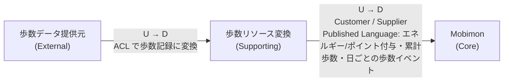
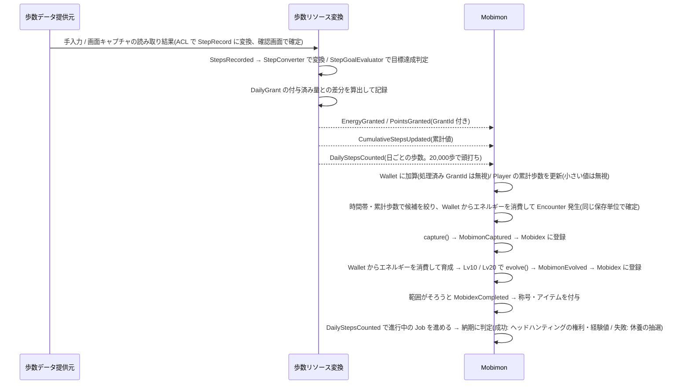

# ドメイン設計

MobimonGO のドメイン設計を、以下の3点で整理する。

1. [ユビキタス言語(用語集)](#1-ユビキタス言語用語集)
2. [境界づけられたコンテキスト(コンテキストマップ)](#2-境界づけられたコンテキストコンテキストマップ)
3. [ドメインモデルの定義](#3-ドメインモデルの定義)

> 注: README のドメイン分解(Mobimon = Core / 歩数リソース変換 = Supporting)を出発点としている。
> README に記載のない項目は、議論で決定した内容を反映している。まだ決まっていないものは末尾の「未決事項」にまとめる。

---

## 1. ユビキタス言語(用語集)

コード上のクラス名・メソッド名・イベント名はこの表の英語表記に揃える。

### Mobimon コンテキスト

| 用語 | 英語表記 | 定義 |
|---|---|---|
| モビモン | Mobimon | ゲーム内で収集対象となるキャラクター。個体を指す。 |
| モビモン種 | MobimonSpecies | モビモンの種類(マスターデータ)。図鑑の1エントリに対応する。 |
| プレイヤー | Player | モビモンを収集するアプリ利用者のゲーム内での表現。 |
| 出現 | Encounter | プレイヤーの前にモビモンが現れること。エネルギーを消費すると必ず1体出現し、どの種が出るかは、出現条件を満たす種の中から、種ごとの重み(レア度で決まる)に比例した抽選で決まる。 |
| 出現条件 | EncounterCondition | モビモン種ごとに定める、出現候補になるための条件。「出現する時間帯」と「解放に必要な累計歩数」の2要素で決める。 |
| 時間帯 | TimeOfDay | 出現時刻(端末のローカル時刻)の区分。朝(5〜10時)/ 昼(10〜16時)/ 夕(16〜19時)/ 夜(19〜翌5時)の4区分。 |
| 累計歩数 | CumulativeSteps | 歩数リソース変換から受け取る、プレイヤーのアプリ利用開始以降の歩数の合計。種の解放判定にだけ使う。 |
| 解放 | Unlock | 累計歩数が種ごとの閾値に達し、その種が出現候補に加わること。一度解放された種は候補から外れない。 |
| 捕獲 | Capture | 出現したモビモンをプレイヤーの所持モビモンにすること。 |
| 所持モビモン | OwnedMobimon | プレイヤーが捕獲して所有しているモビモン個体。 |
| 育成 | Training | エネルギーを 10 消費して、所持モビモンに経験値 100 を与えること。 |
| 経験値 | Experience | 育成で得られ、一定量たまるとレベルが上がる値。次のレベルに必要な量は `50 × 現在のレベル`。 |
| 進化 | Evolution | 所持モビモンが条件レベルに達したとき、プレイヤーの操作で系統の次の種に変わること。レベル・経験値は引き継ぐ。 |
| 図鑑 | Mobidex | プレイヤーが捕獲または進化で手に入れたことのあるモビモン種の記録。 |
| 事業分野 | BusinessField | モビモン種のモチーフとなる事業分野(8分野)。事業分野コンプリートの範囲に使う。どの事業分野にも属さない種もある(伝説のデンまる)。 |
| 図鑑コンプリート | MobidexCompletion | 定めた範囲の種をすべて図鑑に登録し終えた状態。事業分野コンプリート(その分野の超レアを除く全種)と全体コンプリート(151種すべて)の2種類。 |
| 登録数の節目 | Milestone | 図鑑の登録数が 10 / 30 / 50 / 100種に達したこと。デンまるの初登録も特別な節目として扱う。 |
| 称号 | Title | 図鑑コンプリートの報酬としてプレイヤーに与えられる呼び名。 |
| アイテム | Item | ポイントで購入し、使用するとゲーム内の効果を得られる道具。種類・価格・効果はマスターデータで定義する。エネルギーを使ったときの成果を増幅するだけで、エネルギーの代わりにはならない。 |
| 出現率アップアイテム | EncounterBoostItem | 使用するとレア以上のモビモン種の出現重みに倍率が掛かり、レアなモビモンが出やすくなるアイテム。 |
| 育成アイテム | TrainingItem | 使用すると育成で得られる経験値に倍率が掛かるアイテム。 |
| アイテム効果 | ItemEffect | アイテムを使用して得られる効果。種別・倍率・持続回数で表す。 |
| 残り回数 | RemainingUses | 使用中の効果が、あと何回の出現/育成に適用されるか。 |
| 購入 | Purchase | ポイントを支払ってアイテムを入手すること。 |
| 所持アイテム | Inventory | プレイヤーが所有するアイテムとその個数。 |
| ウォレット | Wallet | プレイヤーが保有するエネルギーとポイントの残高。Mobimon コンテキストが管理する。 |
| 組織 | Organization | プレイヤーが集めたモビモンで作る組織。3つのチームを持つ。 |
| チーム | Team | 事業分野ごとの編成。サーマルマネジメント&エアコンシステム / パワートレインシステム / セーフティ&コックピットシステムの3分野だけに作る。 |
| リーダー | Leader | チームの長。そのチームの事業分野の、アンコモン以上のモビモン。レア度で受注できる仕事のランクと、置けるサブリーダーの数が決まる。 |
| サブリーダー | SubLeader | レア・超レアのリーダーの部下のうち、アンコモン・レアのモビモン。下にメンバーを4体まで置ける。 |
| メンバー | Member | リーダーまたはサブリーダーの部下。事業分野・レア度は問わない。 |
| 仕事 | Job | チームが受注する業務。事業分野・業務ランク・納期・業務達成歩数を持つ。 |
| 業務ランク | JobRank | 仕事の難易度。C / B / A / S。 |
| 納期 | Deadline | 業務達成歩数を歩き切る期限(受注してから数える日数)。 |
| 業務達成歩数 | RequiredSteps | 納期までに歩く必要がある歩数。1日に数えるのは 20,000歩まで。 |
| 仕事の掲示板 | JobBoard | その日に受注できる仕事の一覧。毎日入れ替える。 |
| 受注 / 辞退 | Accept / Decline | 仕事を引き受ける / 受注から24時間以内に罰なしでやめる(直近7日間に1回まで)。 |
| 判定 | Judgment | 業務達成歩数を歩き切ったあとに、成功の確率で成否を決めること。 |
| 成功の確率 | SuccessRate | 判定で成功する確率。ランクの基本の確率に、リーダーのレベル・サブリーダー・メンバーの数で上乗せする。 |
| ヘッドハンティング | Headhunting | 仕事の成功で得た権利を使い、モビモンを1体迎えること。 |
| ヘッドハンティングの権利 | HeadhuntingRight | 仕事の成功で得る権利。1つにつき1体を迎えられる。好きなときに使う。 |
| 休養 | Rest | 仕事に失敗したとき、一定の確率でメンバーが入る状態。休養中はチームの仕事・育成に出られず、休養が明けると戻る。 |

### 歩数リソース変換コンテキスト

| 用語 | 英語表記 | 定義 |
|---|---|---|
| ウォーカー | Walker | 歩数の持ち主としてのユーザー。利用開始日を持つ。Mobimon の `Player` と同じ人を指し、IDも同じ値を使う。 |
| 歩数 | StepCount | スマホ等から取得した、ある期間の歩いた数。 |
| 歩数記録 | StepRecord | 特定ユーザー・特定日の歩数の取り込み結果。 |
| 取り込み元 | StepSource | 歩数をどこから取り込んだか。「手入力」と「画面キャプチャ」の2種類。 |
| 手入力 | ManualEntry | ユーザーが日付と歩数を画面に直接入力して取り込むこと。 |
| 画面キャプチャ取り込み | ScreenCaptureImport | 他のヘルスケアアプリの歩数画面のキャプチャ画像から、カレンダーに表示された日々の歩数を読み取って取り込むこと。 |
| 利用開始日 | StartDate | ユーザーがアプリの利用を始めた日。これより前の歩数は取り込まない。利用開始日の歩数は、その日の0時からすべて数える。 |
| 累計歩数 | CumulativeSteps | 特定ユーザーの `StepRecord`(利用開始日以降)の合計。Mobimon へ公開する。 |
| 日ごとの歩数(公開用) | DailyStepsCounted | 特定ユーザー・特定日の歩数を 1日 20,000歩で頭打ちにした値。Mobimon へ公開する(仕事の進み具合に使う)。 |
| エネルギー | Energy | 歩くことで貯まる「1日の行動リソース」(＝歩く努力の結晶)。歩数から変換され、出現・育成などのゲーム内行動で消費する。使い切れなかった分は翌日以降に持ち越せる。 |
| 変換 | Conversion | 歩数をエネルギーへ換算する処理。 |
| 変換ルール | ConversionRule | 歩数→エネルギーの換算規則。100歩 = 1エネルギー(端数切り捨て)、1日の上限は 20,000歩分(200エネルギー)。 |
| 目標歩数 | StepGoal | ポイント獲得の基準となる1日の歩数。全ユーザー共通の固定値(8,000歩)。 |
| ポイント | Point | 目標歩数を達成したご褒美として獲得する「ゲーム内通貨」。出現率アップアイテム・育成アイテムの購入に使う。ポイントでエネルギーは買えない。 |
| ポイント付与ルール | PointAwardRule | 1日の歩数が目標歩数に達したら 10pt、目標歩数を 500歩超えるごとに +5pt を付与する規則。1日の上限はエネルギーと同じ 20,000歩で、それを超えた歩数は数えない(1日の最大 130pt)。 |
| 日次付与記録 | DailyGrant | 特定ユーザー・特定日に付与済みのエネルギー/ポイントの量。二重付与の防止に使う。 |
| 付与ID | GrantId | 付与イベント(`EnergyGranted` / `PointsGranted`)を一意に識別するID。 |

### 同じ言葉がコンテキストで意味を変えるもの

| 言葉 | Mobimon での意味 | 歩数リソース変換での意味 |
|---|---|---|
| ユーザー | `Player`(ゲームの主体) | `Walker`(歩数の持ち主) |
| エネルギー | 出現・育成で「消費するもの」 | 歩数から「生成するもの」 |
| ポイント | アイテム購入で「使うもの」 | 目標歩数の達成で「付与するもの」 |
| 歩数 | 累計値(種の解放判定)と、上限で頭打ちにした日ごとの値(仕事の進み具合)を受け取る | 日ごとに取り込み、エネルギー/ポイントへ変換する |

---

## 2. 境界づけられたコンテキスト(コンテキストマップ)

### コンテキスト一覧

| コンテキスト | 種別 | 責務 |
|---|---|---|
| Mobimon | Core | 出現ロジック、捕獲、育成・進化、図鑑管理・コンプリート報酬、アイテムの購入・使用、エネルギー/ポイント残高の管理、組織・チーム・仕事・ヘッドハンティング。サービス独自の強みであり最も注力する。 |
| 歩数リソース変換 | Supporting | 歩数の取り込み、エネルギーへの変換、目標歩数達成によるポイント付与(付与量の算出と通知。残高は持たない)、累計歩数・日ごとの歩数の公開。 |
| 歩数データ提供元 | External(Generic) | 当面は「ユーザーの手入力」と「他のヘルスケアアプリの歩数画面のキャプチャ画像」の2つ。端末の歩数API(HealthKit / Health Connect など)との連携は将来対応。 |

### コンテキストマップ

### 関係の説明

| 上流 (U) | 下流 (D) | 関係パターン | 内容 |
|---|---|---|---|
| 歩数データ提供元 | 歩数リソース変換 | Anticorruption Layer | 手入力の値や、キャプチャ画像のカレンダーから読み取った値を、腐敗防止層で `StepRecord` に変換してから取り込む。キャプチャ元アプリの画面の変更や、将来の端末の歩数APIの形式をコンテキスト内に波及させない。利用開始日より前の歩数は取り込まない。 |
| 歩数リソース変換 | Mobimon | Customer / Supplier + Published Language | Mobimon(顧客)が必要とするエネルギー/ポイント・累計歩数・日ごとの歩数(上限で頭打ちにした値)を、歩数リソース変換(供給者)がイベント/APIとして公開する。Mobimon は変換ルール・目標歩数を知らず、公開された値だけを受け取る。付与イベントは `GrantId` を持ち、Mobimon は同じ `GrantId` を二度加算しない。イベントに載る `WalkerId` は、Mobimon でそのまま `PlayerId` として扱う(同じ値のため対応表は不要)。 |

### 境界の原則

- Mobimon コンテキストは変換ルール・目標歩数・取り込み元に依存しない。依存するのは付与されたエネルギー/ポイントと、公開された累計歩数・日ごとの歩数(1日 20,000歩で頭打ちにした値)のみ。累計歩数は種の解放判定に、日ごとの歩数は仕事の進み具合にだけ使う。
- 変換ルールの変更(レート調整など)は歩数リソース変換コンテキスト内で完結させる。
- 目標歩数やポイント付与ルールの判定は歩数リソース変換コンテキスト内で完結させる。Mobimon は付与されたポイントを受け取って保持・使用する。
- エネルギー/ポイントの残高は Mobimon コンテキストの `Wallet` が所有する。消費はすべて Mobimon の行動で起きるため、残高と行動を同じコンテキストに置き、Core が Supporting に同期依存しないようにする。歩数リソース変換は付与量を算出してイベントで通知するだけで、消費については知らない。
- 消費(出現・育成でのエネルギー、アイテム購入でのポイント)は、行動と同じ保存単位(DB 導入後は1トランザクション)で確定する。

---

## 3. ドメインモデルの定義

### 3.1 Mobimon コンテキスト(Core)

#### 集約

| 集約(ルート) | 含むもの | 主な振る舞い | 不変条件 |
|---|---|---|---|
| `Player` | `PlayerId`, `CumulativeSteps`, 獲得した称号の一覧 | `updateCumulativeSteps(steps)`, `grantTitle(title)` | 1人のユーザーにつき1つ(`PlayerId` は `WalkerId` と同じ値)。作成時に `Wallet`(残高 0)・`Inventory`(空)・`Mobidex`(空)を同じ保存単位で1つずつ作る。累計歩数は減らない(受け取った値が現在より小さければ無視する)。同じ称号は重複しない。所持モビモンの数に上限は設けない(DB 連携時に見直す)。 |
| `Wallet` | `PlayerId`, `Energy`, `Point`, 処理済み `GrantId` の集合 | `receiveEnergy(grantId, energy)`, `receivePoints(grantId, point)`, `spendEnergy(energy)`, `spendPoints(point)` | 残高は負にならない。同じ `GrantId` は二度加算しない。日付が変わっても残高はリセットしない(持ち越し)。 |
| `Encounter` | `EncounterId`, `PlayerId`, `MobimonSpeciesId`, 状態(出現中/捕獲済み/逃走) | `capture()`, `flee()` | 捕獲済み・逃走済みの出現は再度捕獲できない。 |
| `OwnedMobimon` | `OwnedMobimonId`, `PlayerId`, `MobimonSpeciesId`, `Experience`(累計)、休養が明ける日(休養したことがなければなし)。`Level` は累計経験値から決まる | `train(expMultiplier)`(経験値 100 × 倍率を加え、必要量に達したらレベルを上げる), `gainExperience(amount)`(仕事の成功), `evolve(toSpeciesId)`, `rest(until)`, `isResting(today)` | レベルは 1〜30(捕獲時は 1、Lv30 では経験値が増えない)。進化は、条件レベルに達していて、進化先が `MobimonSpecies` の進化先に含まれるときだけできる。休養が明ける日の前日まで休養中。休養中は育成できず、チームに置いたままでも成功の確率に数えない(リーダーが休養中のチームは受注できない)。 |
| `Mobidex` | `PlayerId`, 登録済み `MobimonSpeciesId` の集合, 達成済みのコンプリート・節目 | `register(speciesId)`, `isCompleted(scope)`(scope: 事業分野 / 全体) | 同じ種は重複登録しない。同じコンプリート・節目は二度達成しない。 |
| `MobimonSpecies` | `MobimonSpeciesId`, 名前, レア度, `EncounterCondition`, `BusinessField`(なしも可), 進化先(`MobimonSpeciesId` の一覧), 進化に必要なレベル, 出現しない種か(`retired`) | `canAppear(timeOfDay, cumulativeSteps)` | マスターデータ(参照専用)。すべての時間帯に、累計 0歩で解放されるコモンの種が1種以上ある(出現候補が空にならない)。出現しない種は出現候補に入らない。 |
| `Item` | `ItemId`, 名前, 価格(`Point`), `ItemEffect` | — | マスターデータ(参照専用)。 |
| `Organization` | `PlayerId`, 3つの `Team` | `assign(...)`, `unassign(...)` | 1体のモビモンが入れるのは1チームまで。仕事を受けているチームは組み替えられない |
| `Team`(`Organization` の中) | 事業分野, リーダー, 部下(最大4), サブリーダーの下のメンバー(各最大4) | — | チームは3分野だけ。リーダーはそのチームの事業分野のアンコモン以上。サブリーダーは自身がアンコモン・レアで、レアのリーダーなら1体・超レアのリーダーなら4体まで。メンバーの事業分野・レア度は問わず、同じ種を何体入れてもよい。進化などで条件を満たさなくなった配置は、受注していないときに自動で外れる |
| `DailyStepLog` | `PlayerId`, 日付ごとの歩数(1日 20,000歩で頭打ちにした値) | `record(date, steps)`, `hasRecorded(date)`, `stepsOn(date)` | 同じ日の値は減らない(小さい値が後から届いたら無視する)。仕事の進み具合と、受注した日の歩数を取り込み済みかの判定に使う |
| `JobBoard` | 日付, その日の仕事(3分野 × 4ランク) | — | 毎日入れ替える。日付から決まる(同じ日なら同じ内容)ので保存しない。仕事の条件(納期・業務達成歩数・確率)は受注したときの値で `Job` に固定 |
| `Job` | `JobId`, `PlayerId`, 事業分野, ランク, 納期, 業務達成歩数, 数え始める日, 受注時のチーム編成, 状態(進行中 / 成功 / 失敗 / 辞退。判定待ちは進み具合から「歩き切った」「納期切れ」として求める) | `accept()`, `progress(log, today)`, `phase(log, today)`, `decline()`, `judge(random)` | チームごとに進行中は1件まで。リーダーのレア度で受注できるランクが決まる。1日に数えるのは 20,000歩まで。進み具合は `DailyStepLog` の数え始める日から納期までの合計(同じ日の値が増えたら差分だけ進む)。受注した時点でその日の歩数を取り込み済みなら、翌日から数える。辞退は受注から24時間以内・直近7日間に1回まで。受注している間はチームを組み替えられない |
| `HeadhuntingRight` | `HeadhuntingRightId`, `PlayerId`, 由来の仕事(事業分野・ランク), 得た日時 | — | 1つにつき1体。使うと `HeadhuntingDraw` で分野 → レア度 → 種の順に抽選してモビモンを迎え、権利はなくなる |
| `Inventory` | `PlayerId`, `ItemId` ごとの個数, 使用中の効果(種別, 倍率, 残り回数) | `add(itemId, quantity)`, `use(itemId)`, `consumeEffect(種別)` | 個数は負にならず、1種類 99個を超えない。持っていないアイテムは使えない。同じ種別の効果が残っている間は同じ種別のアイテムを使えない(出現率アップと育成は同時に使える)。 |

- 特別な節目(デンまるの初登録)は、どの事業分野にも属さない種の初登録として判定する。
- 所持モビモンの一覧は `Player` に持たせず、`OwnedMobimon` を `PlayerId` で検索して得る(集約どうしはIDで参照し、捕獲のたびに2つの集約を更新しないため)。

#### 値オブジェクト

- `PlayerId`, `MobimonSpeciesId`, `OwnedMobimonId`, `EncounterId`, `ItemId`
- `Level` — 1〜30
- `Experience` — 0 以上の整数
- `BusinessField` — 事業分野(8分野)。種によっては持たない
- `Title` — 称号
- `EncounterCost` / `TrainingCost` — 出現・育成1回のエネルギー消費量(どちらも 10)。ゲームの調整値なので Mobimon 側で持つ
- `Rarity` — レア度。コモン / アンコモン / レア / 超レア の4段階。1種あたりの重みは 10 / 5 / 2 / 1
- `ItemEffect` — 種別(出現率アップ/育成), 倍率, 持続回数
- `Energy`, `Point` — 0 以上の数量
- `GrantId` — 歩数リソース変換から受け取る付与イベントのID
- `TimeOfDay` — 朝(5:00〜9:59)/ 昼(10:00〜15:59)/ 夕(16:00〜18:59)/ 夜(19:00〜翌4:59)
- `CumulativeSteps` — 0 以上の整数
- `EncounterCondition` — 出現する時間帯の集合(1つ以上。全時間帯も可), 解放に必要な累計歩数(0 以上)
- `JobRank` — 業務ランク。C / B / A / S
- `TeamRole` — リーダー / サブリーダー / メンバー
- `SuccessRate` — 成功の確率(0〜100%。ランクごとの上限で頭打ち)

#### ドメインサービス

- `EncounterGenerator` — 出現条件・レア度・消費リソース・使用中の出現率アップ効果から、どのモビモン種を出現させるかを決める。**サービスの差別化の中心となるロジック。**
  1. 出現時刻の `TimeOfDay` と `Player` の `CumulativeSteps` で、出現条件を満たす種(候補)に絞る。
  2. 各候補に、レア度で決まる重み(コモン 10 / アンコモン 5 / レア 2 / 超レア 1)を付ける。出現率アップ効果が使用中なら、レア・超レアの重みに倍率(×2 / ×3)を掛ける。
  3. 重みに比例して1種を抽選する。
  - 1種ずつに重みを付けるのは、種数の多いレア度で1種あたりの確率が薄まり、レア度の順序(コモン > アンコモン > レア > 超レア)が逆転するのを防ぐため。
  - 目安(全種解放済み): レア以上の合計は時間帯により 5.4〜7.5%(アロマ使用時 10.3〜13.9%、アロマ+ 使用時 14.7〜19.5%)。特定の超レア1種に会うまで平均 約330〜440回の出現。
- `ItemPurchaseService` — `Wallet` からポイントを消費し、`Inventory` にアイテムを追加する。ポイント不足なら購入できない。
- `JobBoardGenerator` — その日の仕事の掲示板(3分野 × 4ランク)を作る。日付から決まる(実装は `generateJobBoard`)。
- `SuccessRateCalculator`(実装は `successRate()`)— ランクの基本の確率に、リーダーのレベル・サブリーダー・メンバー(休養中を除く)で上乗せし、上限で頭打ちにする。
- `JobJudge`(実装は `Job.judge()` と `drawRest()`)— 納期に歩き切れなければ失敗。歩き切ったら成功の確率で判定し、失敗したら休養の抽選(リーダー・サブリーダーを除くメンバーから1体。すでに休養中の個体は除く)を行う。判定はプレイヤーが「結果を見る」を押したときに行う(歩き切れば納期の前でも、納期を過ぎたら歩き切れていなくても)。休養は判定した日から数える。
- `HeadhuntingDraw`(実装は `drawHeadhunting()`)— ヘッドハンティングの権利1つにつき、分野 → レア度 → 種の順に抽選する。

#### アイテム一覧(初期マスターデータ)

価格は「目標をちょうど達成する人(10pt/日)で2〜3日に1つ」を基準にしている。

| アイテム | 種別 | 効果量 | 持続 | 価格 |
|---|---|---|---|---|
| はちみつアロマ | 出現率アップ | レア以上の重み ×2 | 次の3回の出現 | 30pt |
| 藻由来アロマ | 出現率アップ | レア以上の重み ×3 | 次の5回の出現 | 80pt |
| げんきフード | 育成 | 得られる経験値 ×1.5 | 次の1回の育成 | 20pt |
| げんきフード+ | 育成 | 得られる経験値 ×2 | 次の3回の育成 | 70pt |

- 持続は時間ではなく回数で数える。出現率アップは出現1回ごと(捕獲・逃走を問わない)、育成アイテムは育成1回ごとに残り回数が1減る。
- 購入回数の制限はない。
- 出現・育成では、`Wallet` からのエネルギー消費、行動、`Inventory` の効果の残り回数の減算を同じ保存単位で確定する。

#### 育成と進化

| 項目 | ルール |
|---|---|
| 育成1回 | エネルギー 10 を消費し、経験値 100 を得る(育成アイテム使用中は ×1.5 / ×2) |
| レベルアップ | 次のレベルに必要な経験値は `50 × 現在のレベル`。上限 Lv30 |
| 進化の条件 | 2段階目へは Lv10、3段階目へは Lv20。単独種は進化しない |
| 進化のタイミング | 条件を満たしたら、プレイヤーが好きなときに進化させる(自動では進化しない)。エネルギー・ポイントは使わない |
| 分岐 | ハイブリコは Lv10 で、プラグリン / バッテリオン / スイソリンからプレイヤーが1つを選ぶ |
| 図鑑 | 進化で得た種も図鑑に登録する |
| レベルの意味 | 現時点では進化の条件としてだけ使う |

目安(全エネルギーを1体の育成に使った場合): Lv10 は育成 23回・約3日、Lv20 は 95回・約12日、Lv30 は 218回・約27日。

#### 図鑑コンプリートと報酬

| 達成 | 範囲 | 報酬 |
|---|---|---|
| 登録数の節目 | 10 / 30 / 50種 | はちみつアロマ ×1 |
| 登録数の節目 | 100種 | 藻由来アロマ ×1 |
| 特別な節目 | デンまるを捕まえて図鑑に初めて登録したとき | 称号「Dワールドの覇者」 |
| 事業分野コンプリート(8つ) | その事業分野の種のうち、超レアを除いたすべて | その事業分野の称号(下表)+ 藻由来アロマ ×1 + げんきフード+ ×1 |
| 全体コンプリート | 151種すべて(超レアを含む) | 称号「モビモンマスター」+ 藻由来アロマ ×3 + げんきフード+ ×3 |

称号(マスターデータ: 称号ID, 名前, 対応するコンプリートの範囲):

| コンプリート | 称号 |
|---|---|
| サーマルマネジメント&エアコンシステム | 熱と風の達人 |
| パワートレインシステム | 動力の達人 |
| セーフティ&コックピットシステム | 安全と快適の達人 |
| 半導体・先進デバイス | 半導体の達人 |
| 自動車補修用部品・アクセサリー/修理サービス | 整備の達人 |
| インダストリー | ものづくりの達人 |
| フードバリューチェーン | 食と農の達人 |
| ホーム | 暮らしの達人 |
| 全体コンプリート(151種) | モビモンマスター |
| デンまるの捕獲(特別な節目) | Dワールドの覇者 |

- 報酬はアイテムと称号だけにする。エネルギーは歩数からのみ、ポイントは目標歩数の達成でのみ得る方針を守るため、エネルギー・ポイントは報酬にしない。
- 同じ報酬は二度渡さない。アイテムの所持上限(99個)を超える分は、空きができるまで受け取りを保留する。

#### 組織と仕事

集めたモビモンで組織を作り、3つの事業分野にチームを編成して、歩数で仕事をこなす。仕事に成功すると、モビモンをヘッドハンティングでき、チームの全員に経験値が入る。失敗すると、メンバーが休養に入ることがある。検討の経緯は `thinking-space.md`。

**チーム**

| 項目 | 決まり |
|---|---|
| チームを作る分野 | サーマルマネジメント&エアコンシステム / パワートレインシステム / セーフティ&コックピットシステムの3分野だけ(残りの5分野は当面チームを作らない。その分野のモビモンはメンバーとして入る) |
| 編成 | リーダーの下に部下4体まで。リーダーがレア・超レアなら、部下のうちアンコモン・レアをサブリーダーにでき(レアのリーダーは1体・超レアのリーダーは4体まで)、サブリーダーの下にメンバーを4体まで置ける |
| 最大人数 | アンコモンのリーダー 5体 / レアのリーダー 9体 / 超レアのリーダー 21体 |
| 受注できるランク | リーダーがアンコモン: C・B / レア: B・A / 超レア: A・S |

**仕事**

| ランク | 納期 | 業務達成歩数 | 成功の確率(基本 / 上限) | ヘッドハンティング | 休養の確率(間に合わなかった / 判定で失敗) | 休養の日数 | 成功時の経験値 |
|---|---|---|---|---|---|---|---|
| C | 3日 | 20,000歩 | 85% / 98% | 1人 | 5% / 3% | 3日 | 100 |
| B | 5日 | 45,000歩 | 75% / 95% | 1人 | 10% / 5% | 4日 | 200 |
| A | 7日 | 70,000歩 | 65% / 90% | 2人 | 20% / 10% | 5日 | 300 |
| S | 7日 | 91,000歩 | 50% / 85% | 2人 | 30% / 15% | 7日 | 500 |

- 成功の確率の上乗せ: リーダーの Lv10 ごとに +2%(最大 +6%)/ サブリーダー1体につき +4% / メンバー1体につき +1%。休養中のモビモンは数えない。受注の前と進行中の画面に表示する。
- 成功時の経験値は、受注したときのチームの全員(判定の時点で休養中の個体を除く)に入る。ヘッドハンティングの権利は、成功したときにランクの人数分を受け取る。
- 歩数の数え方: 受注した日の歩数も数えるが、受注した時点でその日の歩数を取り込み済みなら翌日から数える。1日に数えるのは 20,000歩まで。
- 同時に受けられるのはチームごとに1件(最大3件)。受注から24時間以内なら罰なしで辞退できる(直近7日間に1回まで)。
- 報酬はヘッドハンティングの権利と経験値だけ。エネルギー・ポイントは報酬にしない。
- 数字はたたき台。遊んで調整する(`TASKS.md`「11. 組織と仕事」の段階4)。調整しても、受注済みの仕事は受注したときの条件のまま進める。

**ヘッドハンティング**

| 抽選の順 | 決まり |
|---|---|
| ①分野 | 仕事の分野 50% / チームのあるほかの2分野(どちらかを等確率で)30% / チームのない5分野から等確率で1つ 20% |
| ②レア度 | C: コモン 70% / アンコモン 30% ・ B: コモン 30% / アンコモン 55% / レア 15% ・ A: アンコモン 50% / レア 45% / 超レア 5% ・ S: アンコモン 20% / レア 60% / 超レア 20% |
| ③種 | その分野・レア度の種から等確率で1種(該当する種がなければ1つ下のレア度)。**まだ解放されていない種・出現しない種も対象**。デンまるは対象外 |

- ヘッドハンティングした種も図鑑に登録し、コンプリート・節目の報酬の対象にする。
- デンまるには、当面、組織での特別な役割を持たせない(メンバーとしてどのチームにも入れる)。

#### ドメインイベント

| イベント | 発生タイミング | 主な購読者 |
|---|---|---|
| `MobimonEncountered` | モビモンが出現した | — |
| `MobimonCaptured` | 捕獲に成功した | `Mobidex`(図鑑登録) |
| `MobimonTrained` | 育成で経験値・レベルが上がった | — |
| `MobimonEvolved` | 進化した | `Mobidex`(進化先の種を図鑑登録) |
| `MobidexCompleted` | 図鑑がコンプリートされた(範囲: 事業分野 / 全体) | 報酬付与(`Inventory.add()`・`Player.grantTitle()`) |
| `MobidexMilestoneReached` | 登録数の節目、またはデンまるの初登録に達した | 報酬付与(`Inventory.add()`・`Player.grantTitle()`) |
| `ItemPurchased` | ポイントでアイテムを購入した | — |
| `ItemUsed` | アイテムを使用した | — |
| `JobAccepted` / `JobDeclined` | 仕事を受注した / 辞退した | — |
| `JobSucceeded` | 判定で成功した | ヘッドハンティングの権利の付与、チームへの経験値 |
| `JobFailed` | 納期に間に合わなかった、または判定で失敗した | 休養の抽選 |
| `MemberRested` / `MemberReturned` | メンバーが休養に入った / 戻った | — |
| `MobimonHeadhunted` | ヘッドハンティングでモビモンを迎えた | `Mobidex`(図鑑登録) |

### 3.2 歩数リソース変換コンテキスト(Supporting)

#### 集約

| 集約(ルート) | 含むもの | 主な振る舞い | 不変条件 |
|---|---|---|---|
| `Walker` | `WalkerId`, `StartDate` | — | 利用開始日は一度決めたら変わらない。`WalkerId` は `PlayerId` と同じ値。 |
| `StepRecord` | `WalkerId`, 日付, `StepCount`, `StepSource` | `update(stepCount, source)` | 同一ユーザー・同一日の記録は1つ。歩数は負にならない。日付は利用開始日以降で、今日より後の日付は持たない。歩数は減らない(今より小さい値での更新は受け付けない。付与済みのエネルギー・ポイントは取り消せないため)。 |
| `DailyGrant` | `WalkerId`, 日付, 付与済みエネルギー, 付与済みポイント | `recordGrant()` | 同一ユーザー・同一日の記録は1つ。付与済み量は減らない。 |

#### 値オブジェクト

- `StepCount` — 0 以上の整数
- `Energy` — 0 以上の数量
- `ConversionRule` — 100歩 = 1エネルギー(端数切り捨て)、1日の上限 20,000歩(200エネルギー)
- `Point` — 0 以上の数量
- `StepGoal` — 目標歩数。全ユーザー共通の固定値 8,000歩
- `PointAwardRule` — 目標達成で 10pt、目標超過 500歩ごとに +5pt。1日の上限 20,000歩(最大 130pt)
- `GrantId` — 付与イベントを一意に識別するID
- `CumulativeSteps` — 0 以上の整数
- `WalkerId` — ウォーカーのID。初回起動時に1つ発行し、Mobimon の `PlayerId` と同じ値を使う
- `StartDate` — 利用開始日。当日の歩数は0時からすべて数える
- `StepSource` — 取り込み元(手入力 / 画面キャプチャ)

#### ドメインサービス

- `StepConverter` — `StepRecord` の増分に `ConversionRule` を適用して `Energy` を算出する。`DailyGrant` の付与済み量との差分だけを付与し(同じ歩数を二重に変換しない)、1日の上限もここで判定する。
  - 算出式: その日の付与量 = `floor(min(その日の歩数, 20,000) / 100)` − 付与済みエネルギー
  - 同じ日のうちは差分で付与するので、切り捨てた端数は次の取り込みで回収される。日をまたいだ 100歩未満の端数だけが失われる
- `StepGoalEvaluator` — その日の `StepRecord` を `StepGoal` と比較し、`PointAwardRule` に従って付与ポイントを算出する。
  - 算出式: 対象歩数 = `min(その日の歩数, 20,000)`。対象歩数 ≥ 目標歩数 のとき `10 + 5 × floor((対象歩数 − 目標歩数) / 500)`、未達なら 0pt(例: 9,200歩 → 10 + 5 × 2 = 20pt、25,000歩 → 20,000歩として 130pt)
  - 上限の理由: 歩きすぎを促さないためと、歩数の水増しでポイントを大量に得られないようにするため(エネルギーと同じ考え方)
  - 同じ日の歩数が更新された場合は、`DailyGrant` の付与済みポイントとの差分のみ付与する(二重付与しない)。

#### ドメインイベント

| イベント | 発生タイミング | 主な購読者 |
|---|---|---|
| `StepsRecorded` | 歩数を取り込んだ | `StepConverter`, `StepGoalEvaluator`, 累計歩数の再計算 |
| `EnergyGranted` | エネルギーを付与した(`GrantId` 付き) | Mobimon コンテキスト(Published Language。`Wallet` に加算) |
| `PointsGranted` | 目標歩数達成によりポイントを付与した(`GrantId` 付き) | Mobimon コンテキスト(Published Language。`Wallet` に加算) |
| `CumulativeStepsUpdated` | 累計歩数が変わった(増分ではなく累計値そのものを載せる) | Mobimon コンテキスト(Published Language。`Player` の累計歩数を更新) |
| `DailyStepsCounted` | 日ごとの歩数を取り込んだ(その日の値を 1日 20,000歩で頭打ちにして、増分ではなく値そのものを載せる) | Mobimon コンテキスト(Published Language。`DailyStepLog` に記録し、進行中の `Job` の進み具合はそこから求める) |

#### 歩数の取り込み(腐敗防止層)

当面は、次の2つの方法で歩数を取り込む。どちらも、確認画面でユーザーが内容を確かめてから `StepRecord` に反映する。

| 方法 | 内容 |
|---|---|
| 手入力 | 日付と歩数を入力する。 |
| 画面キャプチャ | 他のヘルスケアアプリの歩数画面のキャプチャ画像を読み込み、画面下部のカレンダーから日々の歩数を読み取る(サンプル: `tmp/画面sample.png`)。 |

画面キャプチャの読み取り仕様(サンプル画面の構成に基づく):

| 読み取る対象 | 位置と形式 | 扱い |
|---|---|---|
| 年月 | カレンダーの見出し(例: `2026/09`) | 各日の日付を組み立てるのに使う |
| 日付 | カレンダーの各マスの左上の数字(1〜31)。曜日の並びは日曜はじまり | 年月と組み合わせて日付にする |
| 歩数 | 各マスの右下の数字(カンマ区切り、例: `13,186`) | カンマを除いて整数にする |
| 歩数が空欄のマス | 記録のない日・これから先の日 | 取り込まない |

- 画面上部のグラフ、目標値の表示(例: `目標値:8,000/歩`)、文字色(目標達成日が赤字)は使わない。目標達成の判定は、このアプリの `StepGoal` で行う。
- 次の日は取り込まない: 利用開始日より前の日 / 今日より後の日 / 読み取った年月にない日付。
- 歩数が 0〜100,000 の範囲にない値は、読み取り誤りとして確認画面で修正を求める。
- 今日の歩数は取得時点の途中の値(サンプルの 9/19 は 10歩)。後で取り込み直すと増えた分だけが反映される(歩数は減らないルール、`DailyGrant` による差分付与)。
- 手入力は自己申告になるため、水増しへの歯止めは1日の上限(20,000歩)だけになる。

### 3.3 コンテキストをまたぐ流れ

---

## 4. データの変更と移行

今後の機能追加で、保存済みのデータに影響する変更をどう扱うかの決まり。

### 4.1 保存形式の変更

- 保存するキー(`mobimongo:stepResource` / `mobimongo:mobimon` / `mobimongo:app`)ごとに版番号を持ち、形式を変えたら版を1つ上げる。
- 1つ前の版から変換する関数を `src/<コンテキスト>/infrastructure/migrations/` に追加する。変換関数は保存された JSON を受け取り JSON を返す純粋な関数にし、ドメインのクラスは使わない。公開した変換関数は書き換えない。
- 起動時に古い版なら、元のデータを `<キー>:backup` に1世代残してから最新の版まで変換し、すぐに保存し直す(移行は1回だけ走る)。
- 移行の失敗・読み取れないデータのときは、データを書き換えずに案内画面を出す(データの書き出し、確認してからの初期化)。アプリより新しい版のデータのときは、更新を案内し、初期化は出さない。
- 各版の保存データの見本を `tests/fixtures/storage/<キー>/v<版>.json` に残し、すべての版が最新まで移行して読み込めることをテストで確かめる。手順は `CLAUDE.md` に書く。

- 組織と仕事の追加で `mobimongo:mobimon` の形式が変わる。段階1で版 2(組織・日ごとの歩数の記録を追加。v1 のデータは空の3チームの組織と空の記録として移行)にした。段階2で版 3(受注した仕事を追加。v2 のデータは仕事なしとして移行)にした。段階3で版 4(休養が明ける日・判定日時・ヘッドハンティングの権利を追加。v3 のデータは休養なし・未判定・権利なしとして移行)にした。

### 4.2 マスターデータ(種・アイテム・称号)の変更

- ID は一度公開したら変えず、使い回さない。番号の振り直しはせず、新しい種は末尾に追加する(M152 から)。公開済みの ID と名前は `tests/fixtures/master/published-ids.json` に記録し、テストで確かめる。
- 種をなくすときは、表から消さずに「出現しない種」にする(`MOBIMON_LIST.md` の出現時間帯を「出現しない」にする)。所持モビモン・図鑑の登録は残り、**図鑑の総数・コンプリートの範囲にも含める**。
  - 出現しない種は、出現では手に入らない。それ以降に始めた利用者は、進化か、**仕事の成功で得るヘッドハンティング**(出現しない種も対象)で手に入れる。
- 種を統合するときは、旧 ID → 新 ID の対応で所持モビモン・図鑑を置き換える保存形式の移行(4.1)を作る。
- 保存データにマスターデータにない ID があっても画面は止めず、「不明なモビモン」「不明なアイテム」「不明な称号」として表示し、ログに警告を残す。
- 種を追加しても、達成済みのコンプリート・節目・称号はそのまま残る。未達成のコンプリートは、新しい種を含めた範囲で判定する。

### 4.3 ゲームのルールの変更

- ルール(換算レート・ポイント付与・価格・重み・経験値など)を変えても、**過去には遡らない**。変更後の取り込み・行動から新しいルールを使う。付与済みのエネルギー・ポイント、所持アイテム、レベルは変えない。
- `DailyGrant`(日ごとの付与済み量)は、その時点のルールで計算した結果として残す。同じ日の歩数が後から増えた場合は、新しいルールで計算した量との差分を付与する(減ることはない)。
- 誤りの修正などで遡って直す必要があるときは、そのための保存形式の移行(4.1)を個別に作り、内容を利用者に知らせる。

### 4.4 保存先の変更(データベース連携時)

- データベース連携(`PROPOSAL.md` 提案1)を行うときに、DB の表の移行(版番号付きの SQL の移行ファイル、止めずに変える段階的な変更)と、端末のデータを最新の版にしてからサーバーに引き継ぐ手順を決める。

---

## 未決事項

現在、未決事項はない。

決定済みの参照先:

- 組織と仕事 → 3.1「組織と仕事」(数字はたたき台。遊んで調整する)

- 種ごとの出現時間帯・解放に必要な累計歩数 → `MOBIMON_LIST.md`(確定版)
- 歩数データ提供元 → 当面は手入力と画面キャプチャ(「歩数の取り込み(腐敗防止層)」)。端末の歩数APIとの連携は将来対応
